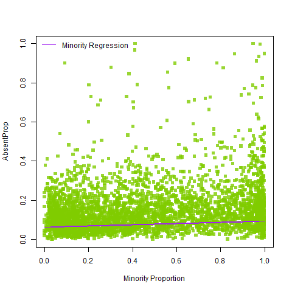
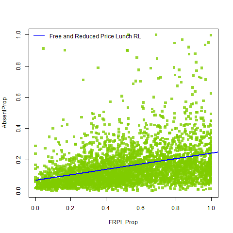
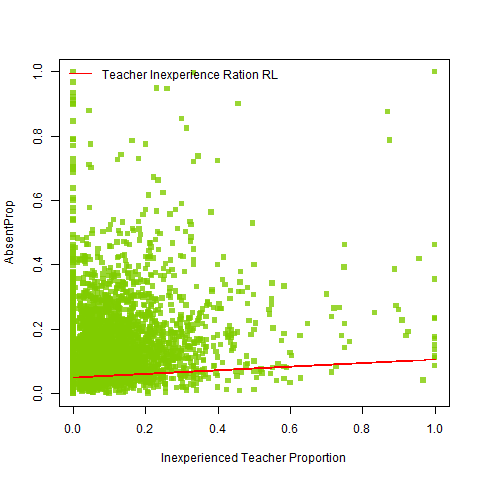
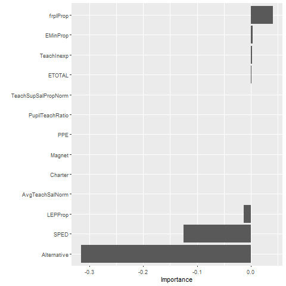

```{r setup, echo=FALSE, include = FALSE}
require("knitr")
opts_knit$set(root.dir = "~/CCNY/Econometrics/Homework/Draft Hwk Files/Final Project/Final-Project")
library(readr)
library(dplyr)
library(AER)
library(stargazer)
library(knitr)
library(kableExtra)
load("InitFPData.RData")
```
```{r FRPL Manipulation, echo = FALSE}
# Manipulating FRPL Data to ascertain total counts; adding to data later as proxy for proportion of students from low socioeconomic background
InitFRPL <- InitFRPL %>%
  rename(COMBOKEY = NCESSCH)
# remove Missing and NA values
initFRPL <- subset(InitFRPL, (LUNCH_PROGRAM == "Free lunch qualified")  | (LUNCH_PROGRAM == "Reduced-price lunch qualified")) 
# extra column to manipulate free lunch status
initFRPL$freelunch <- initFRPL$LUNCH_PROGRAM == "Free lunch qualified"
# create 2 subsets to separate the varible
freelunch <- subset(initFRPL, freelunch == TRUE)
redpricelunch <- subset(initFRPL, freelunch != TRUE)
# combine free lunch and reduced price variables to obtain total number of students eligible for the program
freelunch$redprice <- redpricelunch$STUDENT_COUNT
freelunch$totalfrpl <- (freelunch$STUDENT_COUNT + freelunch$redprice)
```
```{r creating crossed checks obs, echo = FALSE, include = FALSE}
frplcompCOMBOKEY <- suppressWarnings(cbind(InitCAbsentee$COMBOKEY, InitEnrollment$COMBOKEY))
cabscombo <- table(frplcompCOMBOKEY[1:92437,1])
a = as.data.frame(cabscombo)
a <- a%>%
  rename(COMBOKEY = Var1)
frplCOMBO <- left_join(freelunch, a, by="COMBOKEY")
frplCOMBO$Freq[is.na(frplCOMBO$Freq)] <- 0
# sum(frplCOMBO$Freq == 1)
frpldf <- subset(frplCOMBO, Freq != 0)
frplcomp <- data.frame(frpldf$COMBOKEY, frpldf$Freq)
frplcomp <- frplcomp %>%
  rename(COMBOKEY = frpldf.COMBOKEY, Freq = frpldf.Freq)
enrol <- left_join(InitEnrollment, frplcomp, by = "COMBOKEY")
enrol$Freq[is.na(enrol$Freq)] <- 0
# sum(enrol$Freq == 1)
enrol <- subset(enrol, Freq!= 0)
# write.csv(enrol, "UseEnrol.csv")
```
```{r Matching SchExp, echo = FALSE}
schexp <- left_join(InitSchExp, frplcomp, by="COMBOKEY")
schexp$Freq[is.na(schexp$Freq)] <- 0
# sum(schexp$Freq == 1)
schexp <- subset(schexp, Freq != 0)
# write.csv(schexp, "UseSchExp.csv")
```
```{r Matching Retention, echo = FALSE}
retention<- left_join(InitRetention, frplcomp, by="COMBOKEY")
retention$Freq[is.na(retention$Freq)] <- 0
# sum(retention$Freq == 1)
retention <- subset(retention, Freq != 0)
# write.csv(retention, "UseRetention.csv")
```
```{r Matching SchChar, echo = FALSE}
schchar <- left_join(InitSchChar, frplcomp, by="COMBOKEY")
schchar$Freq[is.na(schchar$Freq)] <- 0
# sum(schchar$Freq == 1)
schchar <- subset(schchar, Freq != 0)
# write.csv(schchar, "UseSchChar.csv")
```
```{r Matching SchSup, echo = FALSE}
schsup <- left_join(InitSchSup, frplcomp, by="COMBOKEY")
schsup$Freq[is.na(schsup$Freq)] <- 0
# sum(schsup$Freq == 1)
schsup <- subset(schsup, Freq != 0)
# write.csv(schsup, "UseSchSup.csv")
```
```{r Matching GT, echo = FALSE}
gt <- left_join(InitGT, frplcomp, by="COMBOKEY")
gt$Freq[is.na(gt$Freq)] <- 0
# sum(gt$Freq == 1)
gt <- subset(gt, Freq != 0)
# write.csv(gt, "UseGT.csv")
```
```{r Matching Transfers, echo = FALSE}
transfers <- left_join(InitTransfers, frplcomp, by="COMBOKEY")
transfers$Freq[is.na(transfers$Freq)] <- 0
# sum(transfers$Freq == 1)
transfers <- subset(transfers, Freq != 0)
# write.csv(transfers, "UseTransfers.csv")
```
```{r Matching Dual Enrollment, echo = FALSE}
Dual_Enrollment <- left_join(InitDualEnrol, frplcomp, by="COMBOKEY")
Dual_Enrollment$Freq[is.na(Dual_Enrollment$Freq)] <- 0
# sum(Dual_Enrollment$Freq == 1)
dualenrol <- subset(Dual_Enrollment, Freq != 0)
# write.csv(dualenrol, "UseDualEnrol.csv")
```
```{r Matching FRPL, echo = FALSE}
enrolcomp <- data.frame(enrol$COMBOKEY, enrol$Freq)
enrolcomp <- enrolcomp %>%
  rename(COMBOKEY = enrol.COMBOKEY, Freq = enrol.Freq)
frpldf = select(frpldf, -21)
frpldf <- left_join(frpldf, enrolcomp, by="COMBOKEY")
frpldf$Freq[is.na(frpldf$Freq)] <- 0
# sum(frpl$Freq == 1)
frpldf <- subset(frpldf, Freq != 0)
# write.csv(frpl, "UseFRPL.csv")
```
```{r Matching CAbsenteeism, echo = FALSE}
InitCAbsentee$TOTAL <- (InitCAbsentee$TOTAL_STUDENTS_REPORTED_F + InitCAbsentee$TOTAL_STUDENTS_REPORTED_M)
InitCAbsentee <- InitCAbsentee %>%
  rename(TtlChronicAbsent = TOTAL)
CAbsenteeism <- left_join(InitCAbsentee, enrolcomp, by="COMBOKEY")
CAbsenteeism$Freq[is.na(CAbsenteeism$Freq)] <- 0
# sum(CAbsenteeism$Freq == 1)
CAbsenteeism <- subset(CAbsenteeism, Freq != 0)
# write.csv(CAbsenteeism, "UseAbsenteeism.csv")
# save(CAbsenteeism, dualenrol, enrol, frpl, gt, retention, schchar, schexp, schsup, transfers,  file="MatchedFPData.RData")
detach()
```
```{r Compiling Data for Use, echo = FALSE}
# load("MatchedFPData.RData")
enrol$TtlChronicAbsent <- CAbsenteeism$TtlChronicAbsent
# enrol = select(enrol, -124)
enrol <- enrol %>%
  rename(EASM = SCH_ENR_AS_M, EASF = SCH_ENR_AS_F, EHPM = SCH_ENR_HP_M, EHPF = SCH_ENR_HP_F, EBM = SCH_ENR_BL_M, EBF = SCH_ENR_BL_F, EWM = SCH_ENR_WH_M, EWF = SCH_ENR_WH_F, ETRM = SCH_ENR_TR_M, ETRF = SCH_ENR_TR_F, ETOTALF = TOT_ENR_F, ETOTALM = TOT_ENR_M, ELEPF = SCH_ENR_LEP_F, ELEPM = SCH_ENR_LEP_M, EHIF = SCH_ENR_HI_F, EHIM = SCH_ENR_HI_M, EAMF = SCH_ENR_AM_F, EAMM = SCH_ENR_AM_M, TCAB = TtlChronicAbsent)
enrol$ETOTAL <- (enrol$ETOTALF + enrol$ETOTALM)
enrol$ELEPTTL <- (enrol$ELEPF + enrol$ELEPM)
enrol$EBTTL <- (enrol$EBF + enrol$EBM)
enrol$EHITTL <- (enrol$EHIF + enrol$EHIM)
enrol$EAMTTL <- (enrol$EAMF + enrol$EAMM)
enrol$EASTTL <- (enrol$EASF + enrol$EASM)
enrol$EWTTL <- (enrol$EWF + enrol$EWM)
enrol$EHPTTL <- (enrol$EHPM + enrol$EHPF)
enrol$ETRTTL <- (enrol$ETRF + enrol$ETRM)
enrol$EDISABTTL <- (enrol$SCH_ENR_504_M + enrol$SCH_ENR_504_F + enrol$SCH_ENR_IDEA_M + enrol$SCH_ENR_IDEA_F)
enrol$frpl <- frpldf$totalfrpl
gt$TOT_GTENR_M[gt$TOT_GTENR_M < 0] <- 0
gt$TOT_GTENR_F[gt$TOT_GTENR_F < 0] <- 0
dualenrol$TOT_DUAL_M[dualenrol$TOT_DUAL_M < 0] <- 0
dualenrol$TOT_DUAL_F[dualenrol$TOT_DUAL_F < 0] <- 0
enrol$AdvLearn <- (gt$TOT_GTENR_M + gt$TOT_GTENR_F + dualenrol$TOT_DUAL_F + dualenrol$TOT_DUAL_M)
useData <- enrol
# write.csv(useData, "UseDatav2.csv")
```
```{r Adding Variables from Other Datasets to useData, echo = FALSE}
schsup2 <- schsup %>%
  select(c(7, 9:13, 16:17, 20:22))
# schsup2
useData <- left_join(useData, schsup2, by = "COMBOKEY")
schexp2 <- schexp %>%
  select(c(7, 19, 23, 25:27))
useData <- left_join(useData, schexp2, by = "COMBOKEY")
schchar$SCH_STATUS_ALT <- as.factor(schchar$SCH_STATUS_ALT)
levels(schchar$SCH_STATUS_ALT) <- c(0,1)
schchar$SCH_STATUS_SPED <- as.factor(schchar$SCH_STATUS_SPED)
levels(schchar$SCH_STATUS_SPED) <- c(0,1)
schchar$SCH_STATUS_MAGNET <- as.factor(schchar$SCH_STATUS_MAGNET)
levels(schchar$SCH_STATUS_MAGNET) <- c(0,1)
schchar$SCH_STATUS_CHARTER <- as.factor(schchar$SCH_STATUS_CHARTER)
levels(schchar$SCH_STATUS_CHARTER) <- c(0,1)
schchar2 <- schchar %>%
  select(c(7, 27:30))
useData <- left_join(useData, schchar2, by = "COMBOKEY")
useData <- useData %>%
  rename(FTETeach = SCH_FTETEACH_TOT, TeachCert = SCH_FTETEACH_CERT, TeachNCert = SCH_FTETEACH_NOTCERT, Teach1Y = SCH_FTETEACH_FY, Teach2Y = SCH_FTETEACH_SY, TeachAbsent = SCH_FTETEACH_ABSENT, Counselors = SCH_FTECOUNSELORS, Nurses = SCH_FTESERVICES_NUR, Psychologists = SCH_FTESERVICES_PSY, SocWorker = SCH_FTESERVICES_SOC, TeachSalary = SCH_SAL_TEACH_WFED, SupSalary = SCH_SAL_SUP_WFED, AdminSalary = SCH_SAL_ADM_WFED, PersExp = SCH_SAL_TOTPERS_WFED, NonPersExp = SCH_NPE_WFED, SPED = SCH_STATUS_SPED, Magnet = SCH_STATUS_MAGNET, Charter = SCH_STATUS_CHARTER, Alternative = SCH_STATUS_ALT)
useData$ETTLMIN <- (useData$EAMTTL + useData$EASTTL + useData$EBTTL + useData$EHITTL + useData$EHPTTL + useData$ETRTTL)
useData$EMinProp <- (useData$ETTLMIN/useData$ETOTAL)
useData$EWProp <- (useData$EWTTL/useData$ETOTAL)
useData$LEPProp <- (useData$ELEPTTL/useData$ETOTAL)
useData$frplProp <- (useData$frpl/useData$ETOTAL)
useData$DisabProp <- (useData$EDISABTTL/useData$ETOTAL)
useData$AdvLearnProp <- (useData$AdvLearn/useData$ETOTAL)
useData$PupilTeachRatio <- (useData$ETOTAL/useData$FTETeach)
useData$TeachSupSalProp <- ((useData$TeachSalary+useData$SupSalary)/useData$PersExp)
useData$NonPersPerExpRatio <- (useData$NonPersExp/useData$PersExp)
useData$PPE <- ((useData$PersExp + useData$NonPersExp)/useData$ETOTAL)
useData$SupTeachRatio <- ((useData$Counselors + useData$Nurses + useData$SocWorker + useData$Psychologists)/useData$FTETeach)
useData$TeachInexp <- ((useData$Teach1Y + useData$Teach2Y)/useData$FTETeach)
# write.csv(useData, "UseDatav2.csv")
```
```{r Excluding Missing Values and Problematic Obersvations, echo=FALSE}
# table(useData$JJ == "Yes")
useData <- subset(useData, JJ == "No")
useData2 <- subset(useData, !(AdminSalary < 0 | SupSalary < 0 | ETOTAL < 0 | PersExp < 0 | SupSalary < 0 | AdminSalary < 0 | TeachCert < 0 | NonPersExp < 0 | TeachSalary < 0))
useData2 <- subset(useData2, !(ETOTAL < 10 | FTETeach < 1))
# write.csv(useData2, "FormData.csv")
useData3 <- subset(useData2, (SupSalary > 0 & NonPersExp > 0 & TeachSalary > 0 & PersExp > 0))
```
```{r echo = FALSE}
useData3 <- subset(useData3,!(ETOTAL < TCAB))
useData3 <- subset(useData3, !(ETOTAL < frpl))
```
```{r echo = FALSE}
useData3$AvgTeachSal <- (useData3$TeachSalary/useData3$FTETeach)
useData3$AbsentProp <- (useData3$TCAB/useData3$ETOTAL)
norm_varb <- function(X_in) {
  (X_in - min(X_in, na.rm = TRUE))/( max(X_in, na.rm = TRUE) - min(X_in, na.rm = TRUE) )
}
useData3$AvgTeachSalNorm <- norm_varb(useData3$AvgTeachSal)
useData3$TeachSupSalPropNorm <- norm_varb(useData3$TeachSupSalProp)
# write.csv(useData3, "FormData2.csv")
# summary(useData3)
# save(useData3, file="CleanedData.RData")
```
#### Introduction
Statistical research on education outcomes commonly hones in test scores and graduation rates, outcomes used by the government and academia alike as broad metrics for institutional success. The research provides insights for policy directions to manage issues including outcome gaps due to race and ethnicity differences (Reardon et al. 2016), socioeconomic status differences (Owens 2010) and overall student achievement levels (Grosskopf et al. 2015). There is a subsection of the literature that focuses on the impact and efficiency of educational resources. Predominantly this research has sought to find correlation between resource availability or allocation and educational attainment.

This paper uses the U.S. Department of Education 2017-18 Civil Rights Data Collection, National Center for Education Statistics Common Core of Data 2017-18 Lunch Program Eligibility Survey and the U.s. Department of Education EDFacts Data Set 2017-18 Chronic Absenteeism Table (DG 814) to test for a correlation between school resources and the rate of chronic absenteeism in schools. Chronic absenteeism is defined as missing 15 or more days of school (U.S. Department of Education 2019). Chronic absenteeism can have negative impacts on educational achievements across all levels of education (Balfanz 2016). 

Utilizing a composite data set comprised of variables from the three original data sets, the paper estimates Chronic Absentee rates in schools with a variety of resource and student variables. The estimates demonstrated that non-financial resource variables are statistically significant at the 95% level while financial resource variables do not produced correlations with any notable statistical significance. Further, student variables showed significance in their correlations with chronic absenteeism. The results imply that resource allocation within many schools is not optimal and the resources that are serving students are not impacting rates of chronic absenteeism.

#### Literature Review
The statistical literature on education outcomes has generally focused on assessment scores and graduation rates as functions of cost and socioeconomic inputs. The use of these as dependent variables are useful in that they give a clear picture of how students perform and an indication of how education institutions are operating from an 'end goal' perspective. Some studies have focused on analyzing standardized test results in order to compare outcomes across the United States (Houtenville and Smith Conway 2008; Reardon et al. 2016). The use of standardized test scores as the output metric enables educational outcomes to be assessed across states and school districts. This is an important point as there is autonomy in the curriculum even as low as the district level (Reardon et al. 2016). Accordingly, normalized student level gains in mathematics and reading is one of the most common measures of school district output (Grosskopf et al. 2015).

Despite the convenience of standardized test scores as outputs they can present challenges to the researcher. The State and District focus on maximizing student performance on standardized tests can detract from less measurable educational outcomes. In practice, it "may cause teachers and schools to divert resources away from nontested topics and skills" and in an analytical sense "potentially biases estimates of teacher quality by ignoring teachers’ effects on students’ character skills and related behaviors." (Gershenson 2016, p. 127). Further, standardized test scores provide a narrow measure of student outcomes (Greene et al. 2007). Other studies have examined smaller State and District level data, allowing researchers to make comparisons at the school level, minimizing the difference in assessment standards. Many resource focused studies have used data at the state and district levels to analyze impacts on educational attainment resulting from financing (Cellini et al. 2011), resource quality (Greene et al. 2007), resource allocation (Iatarola and Rubenstein 2007). Across much of the literature, school resources have been found to be have less of an impact on student test scores or graduation rate than student demographic and background factors.

The discussion amongst the literature on school resources and student educational attainment must begin at the decision of which resources to choose as variables. There is some consensus that utilizing finance and expenditure is a valid proxy for available resources. Hedges et al. performed a meta-analysis of studies between 1993 and 2014 that included per pupil expenditure (PPE) as a correlate of student achievement (Hedges et al. 2016). The authors of that study raise an important point in regard to studies of school resources as correlates of student outcomes: different studies focus on different input variables and use different outcome measures. That said, PPE is a common proxy for per student resource allocation. Hedges and his co-authors find that there is "a nonstatistical relationship between PPE and student achievement" (Hedges et al. 2016). This finding echoes the findings of Hanushek (Hanushek 1989) who came to similar conclusions in 1986 and 1997 (Grosskopf 2013).

The key implication of the nonstatistical relationship between PPE and student outcomes is the impact of school-external factors. That is to say, the background of the student has a bearing on that student's educational outcome that is uninfluenced by school spending. In her 2010 study of 11,097 middle and high school students, Ann Owens utilizes racial and socioeconomic composition variables to determine the impact on high school graduation rates and college matriculation rates among students in low-similarity and high-similarity cohorts, controlled against PPE (Owens 2010). The results of Owens' study demonstrate that students from a low socioeconomic neighborhood tend to have their odds of educational attainment lowered when in a cohort with a high proportion of class mates from a high socioeconomic background. She also found "that racial composition may proxy school climate or structural characteristics that affect educational attainment" (Owens 2010). An issue with the racial composition finding may be that the author only used proportions of white and black residents, other ethnicities were not included in the models. 

Where Owens uses racial composition to proxy structural characteristics, David Branham uses a percentage of free and reduced price lunch eligible students as a proxy for the proportion of the cohort living in poverty. The study examines the effects of physical school resources, such as the use of temporary buildings and state of structural repair, on student attendance and drop-out rates (Branham 2004). Branham includes student and teacher effects as controls. His findings suggest that schools with poor physical resources - in a state of disrepair or heavily reliant on temporary structures - are less likely to have students attend school. However, the coefficients Branham calculated from his models are significant to 0.01 and 0.05 in one-tailed tests.

Teacher based variables present in the literature include student-teacher ratio, not to be conflated for class size. Greene explains that the student-teacher ratio "...assesses the availability of human resources for instruction..." (Greene et al 2007). Teacher experience and teacher quality are also variables that could have an influence on various student outcomes that are not adequately addressed in an expenditure variable such as PPE. Houtenville and Smith Conway include the percentage of teachers with Masters and Doctoral degrees as one of five school characteristics. The percentage of teachers with advanced degrees can be viewed as a proxy for "instructional quality" (Greene et al. 2007).

In a study linking teacher quality and student attendance, Gershenson weights teacher experience more heavily in the calculations for teacher effects. "Attendance is an objectively measurable behavior" that is linked with character skills (Gershenson 2019). Absenteeism is an opposite behavior that can have a negative impact on a student's educational outcome. Based on the literature regarding the effect of school resources on student outcome, the rest of this paper will outline and analyze school effects, students effects and resources as correlates of rates of chronic absenteeism.

#### Data
The data used is a dataset comprised of variables from the U.S. Department of Education 2017-18 Civil Rights Data Collection (CRDC), National Center for Education Statistics Common Core of Data 2017-18 Lunch Program Eligibility Survey (CCD) and the U.s. Department of Education EDFacts Data Set 2017-18 Chronic Absenteeism Table (DG 814) (EDFacts). The datasets were able to be linked together due to a common identifier, "COMBOKEY", that is a composite number of a Local Education Agency (LEA) number and a School number (SCH). Issues with these datasets are they do not give individual student level data, and they are self-reported, leaving the collected data vulnerable to reporting mistakes.

The CRDC is the main dataset used to complete the dataset. It is for the School Year 2017-18 and comprises data from 17,637 LEAs and 97,632 schools. The mix of schools includes Elementary, Middle, High, Magnet, Charter, Alternative, Special Education and Justice Facility schools. The EDFacts data is a supplemental file containing, among other elements, information on Chronic Absenteeism for 92,438 schools. Lastly, the CCD dataset contains 494,746 observations: Free lunch eligible, reduced price lunch eligible, missing data and NA values for approximately 123,687 schools.

The CRDC dataset is disaggregated by race, gender, English learner status and disability status. It comprises of multiple data groups. To create the data for the models, the COMBOKEY variable was used to match the following data groups: School Characteristics, School Expenditure, Enrollment, Dual Enrollment, Gifted and Talented, Transfers, Retention and School Support with Chronic Absenteeism and Free and Reduced Price Lunch Data. The common observations reduced the original number of observations from 97,632 to 89204 common observations.

Justice Facility schools (162) were removed from the data, leaving 89,042 observations. Then the data was cleaned for any reserve codes. They were predominantly codes indicating that schools had not reported complete data and had their observations force certified by the Department of Education or that the school did not submit any information in time and completed an action plan to complete information for the next survey (52), leaving 88,990 observations. There were issues with the number of Absent Students and Free and Reduced Price Lunch Eligible students exceeding Total Enrolled Students. These schools were removed. Finally, schools with less that 15 students, 1 full time equivalent teacher or spent zero dollars on Teacher Salary, Support Staff Salary, Personnel Expenditure or Non-Personnel Expenditure were also removed. The final dataset was left with 71,667 schools.

Some variables were added to the dataset, to create totals for enrollment, proportions for Enrolled Minorities, Limited English Proficient students and Free and Reduced Price Lunch eligible students, per pupil expenditure, inexperience teacher to teacher ratio, teacher plus support staff salary to personnel expenditure ratio, average teacher salary and the proportion of chronically absent students.

Taking inital summaries of the dataset presented some large outliers, particularly in the expenditure variables. As a result, Average Teacher Salary and Proportion of Teacher and Support Staff Salary Spending to Total Personnel Expenditure were both normalized.

```{r Student Summary Statistics, echo = FALSE}
Mean <- c(mean(useData3$ETOTAL), mean(useData3$AbsentProp), mean(useData3$PupilTeachRatio), mean(useData3$EMinProp), mean(useData3$frplProp), mean(useData3$LEPProp), mean(useData3$AvgTeachSal), mean(useData3$AvgTeachSalNorm), mean(useData3$PPE), mean(useData3$TeachInexp), mean(useData3$TeachSupSalPropNorm), mean(useData3$SupTeachRatio))
SD <- c(sd(useData3$ETOTAL), sd(useData3$AbsentProp), sd(useData3$PupilTeachRatio), sd(useData3$EMinProp), sd(useData3$frplProp), sd(useData3$LEPProp), sd(useData3$AvgTeachSal), sd(useData3$AvgTeachSalNorm), sd(useData3$PPE), sd(useData3$TeachInexp), sd(useData3$TeachSupSalPropNorm), sd(useData3$SupTeachRatio))
Min <- c(min(useData3$ETOTAL), min(useData3$AbsentProp), min(useData3$PupilTeachRatio), min(useData3$EMinProp), min(useData3$frplProp), min(useData3$LEPProp), min(useData3$AvgTeachSal), min(useData3$AvgTeachSalNorm), min(useData3$PPE), min(useData3$TeachInexp), min(useData3$TeachSupSalPropNorm), min(useData3$SupTeachRatio))
Max <- c(max(useData3$ETOTAL), max(useData3$AbsentProp), max(useData3$PupilTeachRatio), max(useData3$EMinProp), max(useData3$frplProp), max(useData3$LEPProp), max(useData3$AvgTeachSal), max(useData3$AvgTeachSalNorm), max(useData3$PPE), max(useData3$TeachInexp), max(useData3$TeachSupSalPropNorm), max(useData3$SupTeachRatio))
SD <- as.matrix(SD)
Mean <- as.matrix(Mean)
Min <- as.matrix(Min)
Max <- as.matrix(Max)
rownames(Mean) <- c("Total Enrollment", "Chronic Absent Proportion", "Pupil to Teacher Ratio", "Minority Proportion", "Free Lunch Program Proportion", "Limited English Proportion", "Average Teacher Salary", "Normalized Average Teacher Salary", "Per Pupil Expenditure", "Ratio of Inexperienced Teachers to 2+ Year Teachers", "Proportion of Teacher and Support Staff Salary Spending to Total Personnel Expenditure", "Ratio of Support Staff to Teachers")
SumStats <- cbind(Mean, SD, Min, Max)
colnames(SumStats) <- c("Mean", "SD", "Min", "Max")
sumstatskable <- kable(SumStats, format = "html",
      digits = 3,
  align = "l",
  caption = "Summary Statistics") 
# save_kable(sumstatskable, file = "SumStatsTable.png")
sumstatskable
```
The summary statistics demonstrate some severe outliers within the dataset. The self-reported nature of the data could account for these extreme values. Despite the extremities, the mean values of the selected variables seem to be reasonable.

Using this data set, the models will test for the impact of school resources, as measured by Per Pupil Expenditure, Teacher Inexperience, Average Teach Salary, Proportion of Personnel Expenditure on Teachers and Support Staff and the Proportion of Support Staff to Teachers on rates of Chronic Absenteeism. The expenditure on teachers and support staff is being used as a proxy for teacher quality, as the data sets did not have information on teacher qualifications other than whether they meet state certification standards.

The hypothesis is: that added school resources should negatively correlate with the chronic absentee rate, in that more experienced teachers, quality teachers and added support staff create an engaging, positive environment for their students to be in.
```{r Student Summary Stats, echo = FALSE, eval = FALSE}
mean(useData3$ETOTAL)
sd(useData3$ETOTAL)
range(useData3$ETOTAL)
mean(useData3$TtlChronicAbsent)
sd(useData3$TtlChronicAbsent)
range(useData3$TtlChronicAbsent)
mean(useData3$AbsentProp)
sd(useData3$AbsentProp)
range(useData3$AbsentProp)
mean(useData3$PupilTeachRatio)
sd(useData3$PupilTeachRatio)
range(useData3$PupilTeachRatio)
mean(useData3$EMinProp)
sd(useData3$EMinProp)
range(useData3$EMinProp)
mean(useData3$frplProp)
sd(useData3$frplProp)
range(useData3$frplProp)
mean(useData3$LEPProp)
sd(useData3$LEPProp)
range(useData3$LEPProp)
```
```{r Resource Summary Statistics, eval = FALSE, echo = FALSE}
mean(useData3$AvgTeachSal)
sd(useData3$AvgTeachSal)
range(useData3$AvgTeachSal)
mean(useData3$AvgTeachSalNorm)
sd(useData3$AvgTeachSalNorm)
range(useData3$AvgTeachSalNorm)
mean(useData3$PPE)
sd(useData3$PPE)
range(useData3$PPE)
mean(useData3$TeachInexp)
sd(useData3$TeachInexp)
range(useData3$TeachInexp)
mean(useData3$TeachSupSalPropNorm)
sd(useData3$TeachSupSalPropNorm)
range(useData3$TeachSupSalPropNorm)
mean(useData3$SupTeachRatio)
sd(useData3$SupTeachRatio)
range(useData3$SupTeachRatio)
```

#### Methodology
To test the dependent variable, rate of chronic absenteeism, the ordinary least squares regression will be run first. The model will estimate Chronic Absentee Proportion as a function of the resource effects, Per Pupil Expenditure, Teacher Inexperience, Average Teach Salary, Proportion of Personnel Expenditure on Teachers and Support Staff and the Proportion of Support Staff to Teachers, with student effect controls, Pupil to Teacher Ration, Minority Proportion, Free Lunch Eligible Proportion, Limited English Proficiency Proportion and Type of School (Special Education, Charter, Magnet, Alternative. Schools not listed as one of these four categories are other graded and ungraded schools).

Then a Lasso Model will be run using the same variables to test which have the least influence on Chronic Absenteeism. After the Lasso Regression is run, a second OLS regression with the least influential variables removed will be run.

Lastly, an OLS regression with interactions on the remaining variables will be run to test the impact of school type on the remaining variables. 
```{r Train and Test Subsetting, echo = FALSE}
set.seed(6350)
ttobs <- length(useData3$ETOTAL)
# ttobs
selectobs <- (runif(ttobs) < 0.7)
graphobs <- (runif(ttobs) < 0.05)
trainset <- subset(useData3,selectobs)
# trainset
testset <- subset(useData3,(!selectobs))
# testset
graphset <- subset(useData3, graphobs)
#graphset$SPED <- as.factor(graphset$SPED)
#graphset$Magnet <- as.factor(graphset$Magnet)
#graphset$Charter <- as.factor(graphset$Charter)
#graphset$Alternative <- as.factor(graphset$Alternative)
```
#### Results
**OLS**
```{r Initial OLS Regression, echo = FALSE}
absent1 <- lm(AbsentProp ~ AvgTeachSalNorm + TeachInexp + SPED + Alternative + Magnet + Charter + PPE + TeachSupSalPropNorm + ETOTAL + PupilTeachRatio + EMinProp + frplProp + LEPProp, data = useData3)
# summary(absent1)
# stargazer(absent1, type = "text")
# plot(absent1)
absentcoefs <- kable(summary(absent1)$coef, digits=3)
# save_kable(absentcoefs, file = "AbsentOLSCoefs.png")
absentcoefs
```
The initial OLS Regression demonstrates that the expenditure based teacher effect variables have a nonstatistical relationship with chronic absentee rates. The remaining variables, while demonstrating statistically significant correlations, generally have low correlations on chronic absenteeism. It is of interest that Special Education schools and Alternative schools have the largest correlation, both positive, on the rate of chronic absenteeism. Despite potentially having access to greater resources to help serve their students, these two results demonstrate the issues of endogeneity with assessing school resources - are the resources provided to the students to help improve their educational opportunities, or are added resources needed to provide particular cohorts with an acceptable education experience?

Here are some plots of Minority Proportion correlation, Free and Reduced Price Lunch Proportion correlation and Inexperience Teacher Ratio correlation.  

  

  


```{r OLS Plots, echo = FALSE}
# png(filename = "./EMinPropOLS.png")
plot(AbsentProp ~ jitter(EMinProp, factor = 0.0), pch = 15, col = rgb(0.5, 0.8, 0, alpha = 0.8), ylim = c(0,1), xlim = c(0,1), xlab = "Minority Proportion", data = graphset)
attach(graphset)
abspredict <- data.frame(AvgTeachSalNorm = 0.0015, TeachInexp = 0.5, SPED = 0, Alternative = 0, Magnet = 0, Charter = 0, PPE = 7500, ETOTAL = 250, PupilTeachRatio = 15, (EMinProp >= 0.2 & EMinProp <= 0.8), frplProp = 0.05, LEPProp = 0.1, TeachSupSalPropNorm = 0.05)
abspredict$yhat <- predict(absent1, newdata = abspredict)
lines(yhat ~ EMinProp, data = abspredict, col = "Purple" )
legend("topleft", "Minority Regression", col = "Purple", lty = 1, bty = "n")
# dev.off()
detach()
```
```{r echo = FALSE}
# png(filename = "./FRPLPropOLS.png")
plot(AbsentProp ~ jitter(frplProp, factor = 0.0), pch = 15, col = rgb(0.5, 0.8, 0, alpha = 0.8), ylim = c(0,1), xlim = c(0,1), xlab="FRPL Prop", data = graphset)
attach(graphset)
abspredictfrpl <- data.frame(AvgTeachSalNorm = 0.0015, TeachInexp = 0.5, SPED = 0 , Alternative = 0, Magnet = 0, Charter = 0, PPE = 7500, ETOTAL = 250, PupilTeachRatio = 15, EMinProp = 0.5, (frplProp >= 0.1 & frplProp <= 0.9), LEPProp = 0.1, TeachSupSalPropNorm = 0.05)
abspredictfrpl$yhat <- predict(absent1, newdata = abspredictfrpl)
lines(yhat ~ frplProp, data = abspredictfrpl, col = "Blue")
legend("topleft", "Free and Reduced Price Lunch RL", col = "Blue", lty = 1, bty = "n")
# dev.off()
detach()
```
```{r echo = FALSE}
# png(filename = "./TeachInexpOLS.png")
plot(AbsentProp ~ jitter(TeachInexp, factor = 0.0), pch = 15, col = rgb(0.5, 0.8, 0, alpha = 0.8), ylim = c(0,1), xlim = c(0,1), xlab="Inexperienced Teacher Proportion", data = graphset)
attach(graphset)
abspredictinexp <- data.frame(AvgTeachSalNorm = 0.0015, (TeachInexp >= 0.05 & TeachInexp <= 1), SPED = 0, Alternative = 0, Magnet = 0, Charter = 0, PPE = 6500, ETOTAL = 250, PupilTeachRatio = 15, EMinProp = 0.5, frplProp = 0.05, LEPProp = 0.1, TeachSupSalPropNorm = 0.05)
abspredictinexp$yhat <- predict(absent1, newdata = abspredictinexp)
lines(yhat ~ TeachInexp, data = abspredictinexp, col = "Red")
legend("topleft", "Teacher Inexperience Ration RL", col = "Red", lty = 1, bty = "n")
detach()
```

**LASSO**  
The Lasso Model confirms the results of the initial OLS model. THe expenditure related teacher variables have the least impact on estimating the chronic absentee rate. School type remains interesting. The Magnet and Charter schools appear to have little impact on chronic absentee rates.
```{r Standardize Data and Lasso Regression, echo = FALSE, include = FALSE}
dat_for_lasso <- data.frame(
  useData3$AbsentProp,
  useData3$AvgTeachSalNorm,
  useData3$TeachInexp,
  useData3$SPED,
  useData3$Charter,
  useData3$Magnet,
  useData3$Alternative,
  useData3$PPE,
  useData3$TeachSupSalPropNorm,
  useData3$ETOTAL,
  useData3$PupilTeachRatio,
  useData3$EMinProp,
  useData3$frplProp,
  useData3$LEPProp)
names(dat_for_lasso) <- c("AbsentProp",
                                 "AvgTeachSalNorm",
                                 "TeachInexp",
                                 "SPED",
                                 "Charter",
                                 "Magnet",
                                 "Alternative",
                                 "PPE",
                                 "TeachSupSalPropNorm",
                                 "ETOTAL",
                                 "PupilTeachRatio",
                                 "EMinProp",
                                 "frplProp",
                                 "LEPProp")
require("standardize")
set.seed(6350)
NNLasso <- length(dat_for_lasso$AbsentProp)
NNLasso
randomlassoobs <- as.logical(runif(NNLasso) < 0.40)
# summary(restrict_1)
lassotrain <- subset(dat_for_lasso, randomlassoobs)
lassotest <- subset(dat_for_lasso, !randomlassoobs)
sobj <- standardize(AbsentProp ~ AvgTeachSalNorm + TeachInexp + SPED + Alternative + Magnet + Charter + PPE + TeachSupSalPropNorm + ETOTAL + PupilTeachRatio + EMinProp + frplProp + LEPProp, lassotrain, family = binomial)
lassodatatest <- predict(sobj, lassotest)

# Lasso
# install.packages("glmnet")
# install.packages("vip")
require(vip)
require(glmnet)
model1_lasso <-  glmnet(as.matrix(sobj$data[,-1]),sobj$data$AbsentProp, alpha = 1)
par(mar=c(4.5,4.5,1,4))
plot(model1_lasso)
vnat=coef(model1_lasso)
vnat=vnat[-1,ncol(vnat)] 
axis(4, at=vnat,line=-.5,label=names(sobj$data[,-1]),las=1,tick=FALSE, cex.axis=0.5) 
plot(model1_lasso, xvar = "lambda")
plot(model1_lasso, xvar = "dev", label = TRUE)
print(model1_lasso)
cvmodel1_lasso = cv.glmnet(data.matrix(sobj$data[,-1]),data.matrix(sobj$data$AbsentProp),alpha = 1) 
cvmodel1_lasso$lambda.min
plot(cvmodel1_lasso)
log(cvmodel1_lasso$lambda.min)
coef(cvmodel1_lasso, s = "lambda.min")
# png(filename = "./LassoChart.png")
vip(cvmodel1_lasso, num_features = 50, geom = "col")
# dev.off()
lassocoefs <- kable(vnat, digits=3)
# save_kable(lassocoefs, file = "LassoCoefs.png")
```
```{r echo = FALSE}
lassocoefs
```
*Lasso Importance Chart*  


The second OLS model removes two of the school types, leaving the expenditure teacher variables so as not to change the equation drastically.
```{r OLS Lasso Remove Varb, echo = FALSE, include = FALSE}
absentlassoremove <- lm(AbsentProp ~ AvgTeachSalNorm + TeachInexp + SPED + Alternative + PPE + TeachSupSalPropNorm + ETOTAL + PupilTeachRatio + EMinProp + frplProp + LEPProp, data = useData3)
summary(absentlassoremove)
# stargazer(absent1, type = "text")
plot(absentlassoremove)
absentremovecoefs <- kable(summary(absentlassoremove)$coef, digits=3)
# save_kable(absentremovecoefs, file = "AbsentRemoveOLSCoefs.png")
```
```{r echo = FALSE}
absentremovecoefs
```
Having remove the Magnet and Charter school types, expenditure teacher variables still have a nonstatistical relationship to chronic absentee rates. The normalized average teacher salary has less of a correlation at even less significance. Teacher Inexperience ratio increased its level of correlation by 1.5 standard deviations. All other variables remained constant.

To test the impact of school type against the remaining variables, the last OLS regression interacts the Special Education and Alternative school dummary variables against the student and teacher effects variables.
```{r OLS Interactions, echo = FALSE, include = FALSE}
absentinteract <- lm(AbsentProp ~ (AvgTeachSalNorm*SPED) + (TeachInexp*SPED) + (PPE*SPED) + (TeachSupSalPropNorm*SPED) + (ETOTAL*SPED) + (PupilTeachRatio*SPED) + (EMinProp*SPED) + (frplProp*SPED) + (LEPProp*SPED) + (AvgTeachSalNorm*Alternative) + (TeachInexp*Alternative) + (PPE*Alternative) + (TeachSupSalPropNorm*Alternative) + (ETOTAL*Alternative) + (PupilTeachRatio*Alternative) + (EMinProp*Alternative) + (frplProp*Alternative) + (LEPProp*Alternative), data = useData3)
summary(absentinteract)
plot(absentinteract)
absentinteractcoefs <- kable(summary(absentinteract)$coef, digits=3)
# save_kable(absentinteractcoefs, file = "AbsentInteractOLSCoefs.png")
# stargazer(absentinteract, type = "text")
```
```{r echo = FALSE}
absentinteractcoefs
```
The interaction model demonstrates large changes in the correlation of the normalized expenditure variables Average Teacher Salary and Teacher and Support Staff Salary as a Proportion of Personnel Expenditure, when they are interacted with both Special Education and Alternative school type variables. Free Lunch Eligible Proportion and Limited English Proportion variables also change significantly when interacted with the Special Education variable, both taking on insignificant p-values, suggesting that Special Education schools may have cohorts with low proportions of free lunch eligible and limited English proficient students.  We see movements in the same direction of those two variables when interacted with the Alternative school variable, though the movements are to the opposite degree. Both coefficients remain statistically significant. The other variables in the model do not change significantly. This suggests that Special Education and Alternative schools have greater impacts on chronic absenteeism due to expenditure factors than other schools. Specifically, the coefficients suggests that increased spending on Support Staff is beneficial, given that Average Teacher Salary has positive correlation with the interacted Special Education and Alternative school variables while the Proportion of Teacher and Support Staff Salary to Personnel Expenditure has a negative correlation. The implication is that support staff members can provide better outcomes for students in these environments than just regular teachers.

#### Conclusion
The analysis of school resources in these models, in terms of expenditure and non-expenditure measures, implies that there is little correlation with rates of chronic absenteeism. Student factors have more statistically significant relationships with rates of chronic absenteeism but the values of correlation coefficients appear to small to be real world practical. There are issues of endogeneity within the line of inquiry. The first regards proportions of students in poverty. Cohorts with higher proportions of children in poverty, here accounted for through the free lunch program variable, could have higher rates of Limited English Proficiency students. They may also face less engagement from other members of their cohort and the teacher body, presenting issues of disengagement, hostility and lack of support prompting them to be less likely to go to school. Similarly, accounting for Teacher Inexperience Ratio is a less than ideal measure for teacher quality. Teachers with more experience do have advantages for students but experience does not always translate to quality. 

It would be an ideal outcome for policy makers to be presented with the chance to put money towards an initiative or program and know that it will lead to a good outcome. With chronic absenteeism, which can be an indicator for later educational outcomes, this does not appear to be the case. There are too many confounding variables outside the realm of school resources to have an instantaneous impact on reducing rates. Providing support staff, engaging parents and building positive learning environments is but one piece of the education puzzle. Chronic absenteeism appears to be more influenced by background factors. Given the impacts that chronic absenteeism can have on an individual's learning an education, to the extent of damaging matriculation opportunities, it would be well worth pursuing programs within poor and minority communities to reduce the 16% of American school students chronically absent each year (U.S.Department of Education 2019).

#### Bibliography
Balfanz, R. (2016). Missing school matters. The Phi Delta Kappan, 98(2), 8-13. Retrieved December 1, 2020, from http://www.jstor.org/stable/24893461

Branham, D. (2004), The Wise Man Builds His House Upon the Rock: The Effects of Inadequate School Building Infrastructure on Student Attendance. Social Science Quarterly, 85: 1112-1128. https://doi.org/10.1111/j.0038-4941.2004.00266.x

Gershenson, S. (2016). Linking Teacher Quality, Student Attendance, and Student Achievement. Education Finance and Policy 2016 11:2, 125-149. Accessed November 29, 2020, https://www.mitpressjournals.org/doi/full/10.1162/EDFP_a_00180

Grosskopf, S., Hayes, K., Taylor, L.L. et al. (2015). Centralized or decentralized control of school resources? A network model. J Prod Anal 43, 139–150. Accessed December 1, 2020, https://doi.org/10.1007/s11123-013-0379-2

Hanushek, E. (1989). The Impact of Differential Expenditures on School Performance. Educational Researcher, 18(4), 45-62. Retrieved December 12, 2020, from http://www.jstor.org/stable/1176650

Hedges, L., Pigott, T., Polanin, J., Ryan, A., Tocci, C., & Williams, R. (2016). The Question of School Resources and Student Achievement: A History and Reconsideration. Review of Research in Education, 40, 143-168. Retrieved December 4, 2020, from http://www.jstor.org/stable/44668621

Houtenville, A., & Conway, K. (2008). Parental Effort, School Resources, and Student Achievement. The Journal of Human Resources, 43(2), 437-453. Retrieved December 1, 2020, from http://www.jstor.org/stable/40057353

Iatarola, P., & Rubenstein, R. (2007). New Stakes and Standards, Same Ol' Spending? Evidence from New York City High Schools. Education Finance and Policy, 2(1), 74-99. Retrieved December 4, 2020, from http://www.jstor.org/stable/educfinapoli.2.1.74

Lee, T., Cornell, D., Gregory, A., & Fan, X. (2011). High Suspension Schools and Dropout Rates for Black and White Students. Education and Treatment of Children, 34(2), 167-192. Retrieved December 4, 2020, from http://www.jstor.org/stable/42900581

Owens, A. (2010). Neighborhoods and Schools as Competing and Reinforcing Contexts for Educational Attainment. Sociology of Education, 83(4), 287-311. Retrieved December 4, 2020, from http://www.jstor.org/stable/25746205

Reardon, S.F., Kalogrides, D., & Shores, K. (2019). The Geography of Racial/Ethnic Test Score Gaps. The American Journal of Sociology, 124(4). Accessed December 1, 2020, https://cepa.stanford.edu/sites/default/files/wp16-10-v201604.pdf

United States Department of Education. (2019). Accessed December 16, 2020, https://www2.ed.gov/datastory/chronicabsenteeism.html#intro

**Data**  
CRDC (the EDFacts Supplement is included in the CRDC Download) https://www2.ed.gov/about/offices/list/ocr/docs/crdc-2017-18.html
CCD https://nces.ed.gov/ccd/files.asp#Fiscal:2,LevelId:7,SchoolYearId:32,Page:1
